# CHIMERA: AI Revenue Recovery Control Room

Built for the **Razorpay AI Buildathon 2026: Track 3 (AI Revenue Recovery)**.

Track 3 asks builders to answer a clear challenge: **Find revenue that is slipping away and win it back.**

When an online payment fails, most businesses either do nothing, spam the customer with generic "payment failed" messages, or hammer the payment gateway with blind auto-retries. These naive approaches waste money, annoy customers, degrade gateway health, and fail to recover lost revenue.

CHIMERA is an auditable revenue-recovery control room. It detects observable payment failures in real time, diagnoses the operational root cause, uses machine learning to predict which recovery action has the highest probability of success, balances that against costs and customer fatigue, and executes bounded recovery workflows through trusted providers like Razorpay, Exotel, Sarvam AI, and Twilio.

Best of all, CHIMERA does not let a black-box model run wild with business funds. Every recovery action is bounded by strict stopping rules, governed by a deterministic decision engine, and permanently recorded in an append-only audit trail.

---

## Table of Contents

- [Why CHIMERA Exists](#why-chimera-exists)
- [Razorpay Buildathon Track 3: Meeting the Bar](#razorpay-buildathon-track-3-meeting-the-bar)
- [How CHIMERA Works: The Core Loop](#how-chimera-works-the-core-loop)
- [System Architecture](#system-architecture)
- [Supported Recovery Actions](#supported-recovery-actions)
- [Standout Capabilities](#standout-capabilities)
  - [India-First Hinglish Voice Recovery](#india-first-hinglish-voice-recovery-exotel--sarvam-ai)
  - [Razorpay Test Checkout and Dynamic Payment Links](#razorpay-test-checkout-and-dynamic-payment-links)
  - [The Expected Value Decision Engine](#the-expected-value-decision-engine)
  - [Intelligent Retry Sequencer](#intelligent-retry-sequencer)
  - [The Arena: Batch Recovery Measurement](#the-arena-batch-recovery-measurement)
  - [Next.js Operator Command Center](#nextjs-operator-command-center)
- [Quick Start: Run Locally in 2 Minutes](#quick-start-run-locally-in-2-minutes)
- [Live Provider Setup (Razorpay, Exotel, Sarvam, Twilio)](#live-provider-setup)
- [Machine Learning Pipeline and Benchmark Results](#machine-learning-pipeline-and-benchmark-results)
- [Safety, Privacy, and RBI-Aligned Guardrails](#safety-privacy-and-rbi-aligned-guardrails)
- [Repository Tour](#repository-tour)
- [Technology Stack](#technology-stack)
- [Testing and Verification](#testing-and-verification)
- [License](#license)

---

## Why CHIMERA Exists

A failed payment is rarely a single retry button problem. The same failure signal can stem from very different realities:

- A customer got distracted at checkout and let the session expire.
- A card expired, but the customer has active alternative payment methods.
- An issuer bank suffered a brief network outage.
- A customer had insufficient balance on pay-day eve, but will have funds tomorrow.
- A technical integration error occurred between the merchant and the payment gateway.

Treating all these cases with the same blunt action creates contact fatigue, irritates users, racks up vendor messaging fees, and burns payment provider trust.

CHIMERA transforms payment failures into a transparent, data-backed operational workflow:

1. **What happened?** Ingest signed failure events directly from the payment provider.
2. **What can we observe?** Extract features like failure code, card type, historical recovery rate, customer contact count, and gateway uptime.
3. **What is the best action?** Predict recovery probability for every candidate action and calculate net expected value.
4. **Is the action safe?** Check contact windows, fatigue caps, and gateway health.
5. **What happened next?** Execute through a safe provider adapter and wait for bank-verified recovery.

Every single decision is replayable, explainable, and accountable.

---

## Razorpay Buildathon Track 3: Meeting the Bar

The Razorpay AI Buildathon set a high bar for Track 3:

> "The bar: Don't just identify the problem. Show measured money recovered across a batch, with compliant escalation, stopping rules, and an audit trail."

Here is how CHIMERA directly answers each requirement:

| Track 3 Requirement | How CHIMERA Delivers |
| --- | --- |
| **Detect Revenue at Risk** | Ingests verified webhooks from Razorpay Checkout and local payment engines, categorizing failures into actionable operational buckets (issuer decline, technical degradation, expired method, insufficient funds). |
| **Right Intervention & Bounded Workflow** | Evaluates 7 discrete candidate actions (`PAYMENT_LINK`, `SEND_MESSAGE`, `VOICE_RECOVERY`, `RETRY_NOW`, `RETRY_LATER`, `ESCALATE`, `DO_NOTHING`) using calibrated ML probabilities and an expected-value calculation. |
| **Hinglish Voice Recovery** | Implements real-time telephony recovery via Exotel AgentStream WebSockets coupled with Sarvam AI speech models. The agent speaks natural Hinglish, understands customer intent, and dispatches a payment link upon request. |
| **Stopping Rules & Restraint** | Enforces hard limits: max 2 contacts per week, 7-day fatigue penalties, quiet-hours contact windows, and automatic circuit breakers when a provider is degraded. `DO_NOTHING` is selected whenever net recovery value is negative. |
| **Compliant Escalation** | Routes complex, high-value, or repeated failures to an operator-review queue (`ESCALATE`) with complete context, so human teams can step in safely. |
| **Show Measured Money Recovered Across a Batch** | Built-in **Arena Simulator** tests policies against batches of 5,000+ synthetic failure cases across disjoint random seeds, reporting total recovered rupees, recovery rates, action costs, and net revenue lift. |
| **Full Audit Trail** | Maintains an append-only ledger of every webhook event, feature snapshot, candidate score, policy gate check, telephony turn, message dispatch, and payment outcome. |

---

## How CHIMERA Works: The Core Loop

1. **Payment Fails:** A customer payment fails on Razorpay Checkout. Razorpay sends a cryptographically signed `payment.failed` webhook to CHIMERA.
2. **Case Creation:** CHIMERA validates the HMAC-SHA256 signature and opens a `RecoveryCase`. Browser redirects alone never trigger cases; only authoritative provider signals are trusted.
3. **Feature Construction:** An observable feature builder extracts 170 interaction features without peeking into future data or customer personal information.
4. **Probability Prediction:** A versioned, Platt-calibrated machine learning model estimates:
   ```text
   P(recovery within 7 days | observable context, candidate action)
   ```
5. **Expected Value Scoring:** The decision engine compares all candidate actions by calculating Expected Net Value:
   ```text
   Expected Net Value = (Predicted Probability * Recoverable Amount)
                        - Provider Cost
                        - Incentive Cost
                        - Contact Fatigue Penalty
   ```
6. **Policy Gate Validation:** The engine checks constraints. If it is 11 PM, voice calls are blocked. If the customer was messaged 3 times this week, outbound messages are blocked. If provider health is red, retries are paused.
7. **Action Execution:** The winning action is stored as an `Intervention` and handed to the orchestrator.
8. **Outcome Confirmation:** The loop is only closed when a verified payment success webhook arrives with matching amount and currency. Conversational promises alone do not count as recovered money.

---

## System Architecture

The diagram below shows the clean boundaries between the operator dashboard, the authoritative decision engine, external providers, the audit trail, and the offline simulation benchmark pipeline.

```mermaid
flowchart LR
  operator[Operator]
  browser[Next.js operator dashboard]
  api[FastAPI application\n/api/v1]
  db[(SQLite or PostgreSQL)]

  checkout[Initial checkout\nPaymentOrderService]
  payment[Razorpay or local\nPaymentProvider]
  webhook[Verified webhook\nHMAC + idempotency]

  case[RecoveryCase\nobservable context]
  model[Versioned recovery model\nprobability estimates]
  engine[Deterministic DecisionEngine\nEV + costs + fatigue + constraints]
  intervention[Intervention state machine\nstored action authority]
  orchestrator[RecoveryOrchestrator]

  providers[Provider adapters\npayment · messaging · voice · retry · escalation]
  journey[RecoveryJourneyService\nchronological projection]
  intelligence[Read-only intelligence\n diagnosis + outcome narrative]

  simulator[Frozen simulator +\nsynthetic truth artifacts]
  benchmark[Model training, calibration\nand Arena evaluation]

  operator --> browser
  browser --> api
  api <--> db

  browser -->|start test checkout| checkout
  checkout --> payment
  payment -->|signed success/failure event| webhook
  webhook --> api
  api -->|failed initial payment| case

  case --> model
  model --> engine
  engine --> intervention
  intervention --> orchestrator
  orchestrator --> providers
  providers -->|provider events and callbacks| api
  providers --> payment

  api --> journey
  journey --> intelligence
  journey --> browser
  intelligence --> browser

  simulator --> benchmark
  benchmark -->|compatible artifact| model

  classDef ui fill:#132023,stroke:#55d6a7,color:#f3f7f5;
  classDef authority fill:#1b241d,stroke:#55d6a7,color:#f3f7f5;
  classDef provider fill:#282116,stroke:#f2b86b,color:#fff6e8;
  classDef storage fill:#161b20,stroke:#78909c,color:#edf3f5;
  classDef offline fill:#211c2a,stroke:#b7a1ff,color:#f5f0ff;

  class operator,browser ui;
  class api,case,model,engine,intervention,orchestrator,journey,intelligence authority;
  class checkout,payment,webhook,providers provider;
  class db storage;
  class simulator,benchmark offline;
```



### Architectural Guardrails

- **Frontend is a presentation layer:** The Next.js dashboard never calculates probabilities, net values, or rankings. It reads API state and issues explicit operator commands.
- **Decision engine has sole authority:** Only the backend engine selects an action, preserving a complete score snapshot of every candidate.
- **Intervention state machine is monotonic:** Once an action is selected, the state machine transitions forward through queued, executing, succeeded, or failed states.
- **Providers are isolated boundaries:** A successful provider response (like "SMS delivered") only means transport succeeded, not that the payment was recovered.
- **Explanations are read-only:** An optional language model provides plain-English summaries of stored decisions for human operators. It cannot modify or re-score a decision.

---

## Supported Recovery Actions

CHIMERA evaluates 7 distinct actions for every single recovery case:

| Action | What It Does | Best Used When |
| --- | --- | --- |
| `PAYMENT_LINK` | Generates a dynamic Razorpay payment link and tracks completion. | Customer abandoned checkout or wants an alternate payment mode. |
| `SEND_MESSAGE` | Dispatches an SMS or WhatsApp message with recovery details and payment link. | Low-friction drop-offs where an immediate reminder is enough. |
| `VOICE_RECOVERY` | Initiates an interactive Hinglish voice call via Exotel and Sarvam AI. | High-value payments, subscription renewals, or older payment failures needing personal clarification. |
| `RETRY_NOW` | Executes a single, bounded payment retry immediately. | Transient network blips or momentary gateway connection drops. |
| `RETRY_LATER` | Schedules a retry for an optimal future window. | Insufficient funds near month-end or known scheduled bank maintenance windows. |
| `ESCALATE` | Routes the case to human operations with full historical notes. | High-value VIP transactions, suspicious activity, or repeated failures. |
| `DO_NOTHING` | Takes zero action and logs the reason. | Unprofitable recovery cost, customer already over fatigue limit, or low chance of success. |

---

## Standout Capabilities

### India-First Hinglish Voice Recovery (Exotel + Sarvam AI)

Many Indian customers do not click SMS links from unknown senders. A polite, natural phone call in Hinglish dramatically improves trust and recovery rates.

CHIMERA features a dedicated streaming voice engine:
- **Telephony:** Integrates with Exotel using bi-directional WebSockets (`AgentStream`) to stream audio with low latency.
- **Speech Intelligence:** Uses Sarvam AI for fast Indian-accent speech-to-text (STT) and natural Hindi/Hinglish text-to-speech (TTS).
- **Safe State Machine:** The conversation is strictly bounded. The agent introduces the merchant, explains the payment failure, listens to the customer response, and asks if they want a payment link sent to WhatsApp or SMS.
- **Intent to Payment:** If the customer says "Haan, link bhej do" (Yes, send the link), the agent captures the intent, calls the payment service to create a dynamic Razorpay link, dispatches it via messaging, and politely ends the call.

### Razorpay Test Checkout and Dynamic Payment Links

CHIMERA includes an end-to-end integration with Razorpay:
- **Initial Checkout:** Launch test payment orders using Razorpay Checkout directly from the dashboard.
- **Webhook Ingestion:** Verified via raw body HMAC-SHA256 signature checking.
- **Recovery Links:** When `PAYMENT_LINK` is chosen, CHIMERA calls Razorpay's Payment Links API to generate a fresh, secure checkout URL.
- **Reconciliation:** Webhooks confirm whether the customer paid through the recovery link, automatically matching the order ID, amount, and currency.

### The Expected Value Decision Engine

Instead of hand-coded `if/else` rules, CHIMERA uses financial decision theory:

```text
Expected Gross Recovery = Predicted Probability * Recoverable Amount
Expected Net Value       = Expected Gross Recovery - Direct Cost - Fatigue Penalty
```

- **Direct Costs:** Phone calls cost more than SMS, which costs more than auto-retries.
- **Fatigue Penalty:** Contacting a customer chips away at goodwill. Each contact within the last 7 days adds an escalating penalty.
- **Hard Constraints:** If the net value is negative, CHIMERA picks `DO_NOTHING`, saving the merchant money and protecting customer relationships.

### Intelligent Retry Sequencer

Payment retries are not free. Card networks and banks monitor retry rates, and excessive retries lead to merchant penalties. CHIMERA splits retries into two smart categories:
- `RETRY_NOW`: Bounded to 1 attempt. Used only when the root cause indicates a network timeout.
- `RETRY_LATER`: Enforces deterministic scheduling. The attempt is held in a database queue and cannot execute before its scheduled timestamp.

### The Arena: Batch Recovery Measurement

To satisfy the Buildathon requirement of showing measured money recovered across a batch, CHIMERA provides the **Arena**:
- Simulates realistic payment failure scenarios across 5,000+ synthetic events.
- Evaluates competing recovery policies side by side (Naive Retries vs Fixed Payment Links vs CHIMERA Expected Value).
- Measures recovery rate, recovered revenue in rupees, intervention costs, customer fatigue penalties, and net financial lift.
- Uses disjoint seeds so test evaluation never leaks into training data.

### Next.js Operator Command Center

A high-density desktop interface built for financial operations teams:
- **Command Center:** Live metrics showing revenue at risk, recovery rates, active cases, and gateway health.
- **Case Queue:** Search and filter failed payments by amount, failure reason, and customer segment.
- **Decision Room:** Step into any case to inspect the timeline, candidate scores, policy rule checks, and voice call transcripts.
- **Provider Health:** Real-time visibility into Razorpay, Exotel, Sarvam, Twilio, and database connections.

---

## Quick Start: Run Locally in 2 Minutes

CHIMERA runs locally without requiring any external accounts or paid API keys. All external services default to fast, deterministic local mock providers.

### Prerequisites

- Python 3.12 or compatible modern Python 3
- Node.js 18.17+ and npm
- Terminal (PowerShell, Bash, or Zsh)

### 1. Configure the Environment

Clone the repository and create your local environment file:

```powershell
Copy-Item .env.example .env
```

The default `.env` is pre-configured for credential-free local development:

```dotenv
DATABASE_URL=sqlite+pysqlite:///./chimera-local.db
API_ENVIRONMENT=development
PAYMENT_PROVIDER=local
MESSAGING_PROVIDER=local
VOICE_PROVIDER=local
RETRY_PROVIDER=local
CHIMERA_ALLOW_LIVE_EXECUTION=false
```

### 2. Install Backend Dependencies

Create a virtual environment and install dependencies:

```powershell
python -m venv .venv
.\.venv\Scripts\Activate.ps1
python -m pip install -r requirements.txt
```

*(On macOS/Linux, activate using `source .venv/bin/activate`)*

### 3. Start the Backend API

Run the FastAPI server:

```powershell
$env:PYTHONPATH = (Get-Location).Path
python -m uvicorn backend.app.main:app --reload --port 8000
```

The API is live at `http://localhost:8000`. Interactive Swagger documentation is at `http://localhost:8000/docs`.

### 4. Start the Frontend Dashboard

In a second terminal window:

```powershell
Set-Location frontend
npm install
npm run dev
```

Open `http://localhost:3000` in your browser. Next.js automatically proxies API calls to the backend at port 8000.

### 5. Run a Demo Scenario

1. In the dashboard, navigate to **Evaluation Lab -> Demo Scenarios**.
2. Select a scenario (for example, "High Value Dropoff" or "Technical Network Blip").
3. Click **Run scenario**.
4. Watch CHIMERA ingest the failure, score candidate actions, enforce stopping rules, execute the intervention, and update the audit journey in real time.

You can also run backend demo scripts directly from the terminal:

```powershell
python backend/scripts/run_payment_demo.py
python backend/scripts/run_orchestration_demo.py
python backend/scripts/run_voice_demo.py
```

---

## Live Provider Setup

When you are ready to test with real external providers, configure the relevant credentials in `.env`:

### Razorpay Test Mode

```dotenv
PAYMENT_PROVIDER=razorpay
PAYMENT_ENABLED=true
RAZORPAY_KEY_ID=rzp_test_your_key_id
RAZORPAY_KEY_SECRET=your_key_secret
RAZORPAY_WEBHOOK_SECRET=your_webhook_secret
RAZORPAY_MODE=TEST
```

Webhooks should point to: `POST /api/v1/payments/webhook/razorpay`

### Exotel and Sarvam AI (Hinglish Voice)

```dotenv
VOICE_PROVIDER=exotel
EXOTEL_API_KEY=your_exotel_key
EXOTEL_API_TOKEN=your_exotel_token
EXOTEL_SUBDOMAIN=your_subdomain
SARVAM_API_KEY=your_sarvam_key
```

### Twilio Messaging (SMS & WhatsApp)

```dotenv
MESSAGING_PROVIDER=twilio
TWILIO_ACCOUNT_SID=your_account_sid
TWILIO_AUTH_TOKEN=your_auth_token
TWILIO_FROM_NUMBER=+1234567890
```

> **Safety Gate:** Real external side-effects are blocked unless `CHIMERA_ALLOW_LIVE_EXECUTION=true` is set. This prevents accidental messages or real bank calls during development.

---

## Machine Learning Pipeline and Benchmark Results

CHIMERA uses an observable-only predictive model. It only sees features that existed at the exact moment of payment failure, preventing data leakage.

### Observable Feature Groups

- **Payment Context:** Amount in paise, currency, payment method, original order state.
- **Failure Context:** Issuer decline, card expiration, insufficient balance, gateway degradation.
- **Operational Context:** Provider health status, gateway error rate, retry eligibility.
- **Customer History:** Count of contacts in the past 7 days, historical recovery ratio.
- **Interaction Features:** Cross-products between candidate actions and failure reasons (170 total interaction features).

### Frozen Benchmark Results

Models were trained on 35,000 action-conditioned rows, calibrated on validation data, and evaluated once on a held-out test split of 10,500 rows:

| Model Architecture | ROC-AUC | PR-AUC | Brier Calibration Score | Status |
| --- | ---: | ---: | ---: | --- |
| Baseline Logistic Regression | 0.7248 | 0.6220 | 0.2056 | Reference |
| **Interaction Logistic Regression** | **0.7377** | **0.6376** | **0.2012** | **Selected Champion** |
| Gradient Boosted Stumps | 0.7108 | 0.5944 | 0.2094 | Candidate |

### Reproducing the ML Pipeline

You can re-run data generation, training, and benchmarking with these CLI commands:

```powershell
# 1. Generate synthetic dataset with diagnostics
python backend/scripts/generate_simulator.py --split arena_development --seed 400000 --count 1000

# 2. Train and calibrate the recovery model
python backend/scripts/train_recovery_model.py

# 3. Benchmark models on frozen holdout data
python backend/scripts/benchmark_recovery_models.py

# 4. Run the batch Arena comparison
python backend/scripts/run_baseline_arena.py --split arena_development --seeds 400000 410000 420000 --count-per-seed 1000
```

---

## Safety, Privacy, and RBI-Aligned Guardrails

Handling financial recovery in India requires careful security and regulatory alignment:

- **Payment Data Minimization:** Hosted Razorpay Checkout is used. CHIMERA never touches or stores raw card numbers, CVV codes, or net banking passwords.
- **Secret Protection:** Provider keys and webhook secrets reside strictly in server-side environment variables and are never exposed in browser bundles.
- **Cryptographic Webhook Verification:** Incoming webhooks are validated against the raw request body using HMAC-SHA256 before any parsing occurs.
- **Idempotency and Duplicate Safety:** Provider event IDs are tracked to prevent duplicate processing. All payment state transitions are strictly monotonic.
- **Customer Contact Restraint:** Automatic enforcement of quiet hours and contact frequency limits (maximum 2 contacts per week) to prevent customer harassment.
- **Immutable Audit Trail:** Decisions, candidate scores, rule evaluations, and outcomes are permanently logged in an append-only table.

---

## Repository Tour

```text
CHIMERA/
├── backend/
│   ├── app/                    FastAPI routes, schemas, database models
│   ├── chimera_arena/          Batch policy evaluation and comparison
│   ├── chimera_engine/         Expected-value decision engine and constraints
│   ├── chimera_intelligence/   Read-only decision explanations and summaries
│   ├── chimera_learning/       Outcome tracking, drift detection, and calibration
│   ├── chimera_messaging/      SMS and WhatsApp notification providers
│   ├── chimera_model/          Feature builder, training scripts, model artifacts
│   ├── chimera_orchestration/  Action execution and escalation queues
│   ├── chimera_payments/       Razorpay orders, payment links, and webhooks
│   ├── chimera_provider_health/ Health checks and connectivity probes
│   ├── chimera_retry/          Immediate and scheduled retry boundary
│   ├── chimera_simulator/      Synthetic failure generator and Arena engine
│   ├── chimera_voice/          Exotel streaming WebSockets and Sarvam AI Hinglish agent
│   └── scripts/                CLI runners for demos, training, and benchmarks
├── frontend/
│   ├── app/                    Next.js App Router pages (Command Center, Cases, Arena)
│   ├── components/             Glassmorphic UI components, journey view, charts
│   └── lib/                    Typed API client, formatters, and utilities
├── data/
│   ├── simulator_v1/           Synthetic event datasets and diagnostics
│   ├── model_v1/               Model artifacts, feature schemas, manifests
│   └── model_benchmark_v1/     Benchmark reports and model selection records
├── docs/                       Architecture notes, payment specs, and provider guides
├── tests/                      Comprehensive backend, model, and integration tests
├── .env.example                Configuration template with safe defaults
├── alembic.ini                 Database migration configuration
└── requirements.txt            Python dependencies
```

---

## Technology Stack

| Layer | Technologies | Role |
| --- | --- | --- |
| **Frontend** | Next.js 14, React 18, TypeScript, Tailwind CSS | Operator command center, decision room, and demo lab |
| **Backend** | FastAPI, Python 3.12, Pydantic v2 | High-performance REST and WebSocket API |
| **Database** | SQLAlchemy 2.0, SQLite (Local), PostgreSQL (Prod) | Structured operational data and immutable audit logs |
| **Machine Learning** | NumPy, Scikit-learn, Platt Scaling | 170-feature calibrated recovery probability models |
| **Payments** | Razorpay Checkout, Razorpay Payment Links API | Order creation, test checkout, and payment reconciliation |
| **Voice & Speech** | Exotel AgentStream WebSockets, Sarvam AI | Low-latency telephony and natural Hinglish conversational AI |
| **Messaging** | Twilio SMS/WhatsApp, Meta WhatsApp API | Multi-channel recovery notifications |
| **Simulation** | Custom Monte Carlo Event Simulator | Batch policy evaluation and counterfactual testing |

---

## Testing and Verification

Run the comprehensive test suite across frontend and backend:

```powershell
# Run backend unit, integration, and model tests
python -m unittest discover -s tests -p "test_*.py"

# Run frontend TypeScript and linting checks
Set-Location frontend
npm run lint

# Check frontend production build
npm run build
```

---

## License

This project is licensed under the MIT License. See [LICENSE](LICENSE) for details.
